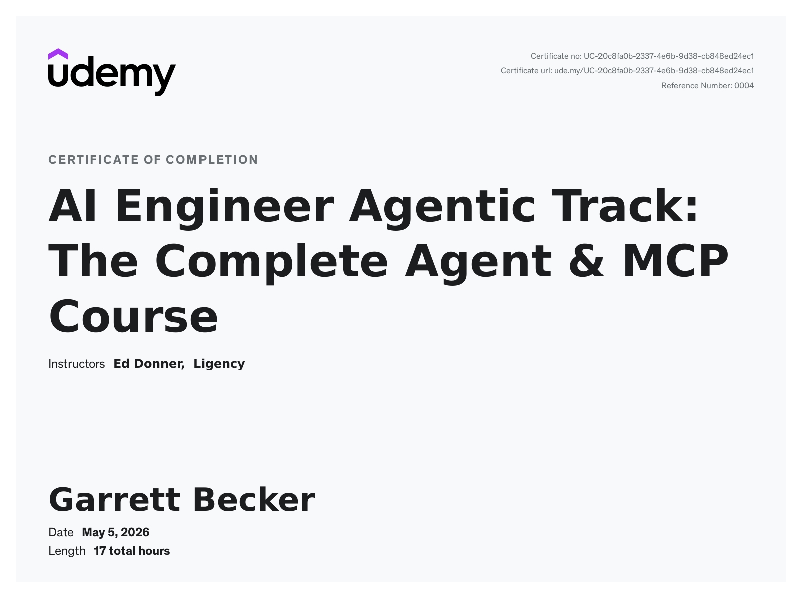

# Udemy - AI Engineer Agentic Track: The Complete Agent & MCP Course

Projects and learning from Ed Donner's [AI Engineer Agentic Track: The Complete Agent & MCP Course on Udemy](https://www.udemy.com/course/the-complete-agentic-ai-engineering-course/).

### [Certificate](https://www.udemy.com/certificate/UC-20c8fa0b-2337-4e6b-9d38-cb848ed24ec1/)

### Course Details

#### What you'll learn
- Project 1: Career Digital Twin. Build and deploy your own Agent to represent you to potential future employers.
- Project 2: SDR Agent. An instant business application: create Sales Representatives that craft and send professional emails .
- Project 3: Deep Research. Make your own version of the essential Agentic use case: a team of Agents that carry out extensive research on any topic you choose.
- Project 4: Build a Stock Picker Agent in minutes with CrewAI—automate your search for investment gems!
- Project 5: Deploy your own 4-Agent Engineering Team—manage, build, and test software apps with CrewAI and Coder Agents in Docker!
- Project 6: Build your own version of OpenAI’s Operator Agent—your Sidekick works with you inside your browser via LangGraph!
- Project 7: Agent Creator—an Agent that builds and launches new Agents using AutoGen, unlocking endless AI possibilities!
- Project 8: Capstone—build a Trading Floor with 4 Agents making autonomous trades, powered by 6 MCP servers and 44 tools!

#### Requirements
- While it’s ideal if you can code in Python and have some experience working with LLMs, this course is designed for a very wide audience, regardless of background. I’ve included a whole folder of self-study labs that cover foundational technical and programming skills. If you’re new to coding, there’s only one requirement: plenty of patience!
- The course runs best if you have a small budget for APIs, but it’s totally your choice. You can complete the entire course with no API spend. If you do wish to use frontier models, the typical spend would be under $5. You can choose to access more capabilities if you’re comfortable spending a little more.

#### Description
2026 is nothing short of a watershed moment for AI Agents. It has never been more important to be an expert with Agentic AI. And that is precisely the goal of this course: to equip you with the skills and expertise to design, build and deploy Autonomous AI Agents, opening up new career and commercial opportunities.

This is an intensive 6-week program to master Agentic AI. We start by building foundational expertise, connecting LLMs using proven design patterns. Then, each week, we upskill with new frameworks: OpenAI Agents SDK, CrewAI, LangGraph and Autogen. The course culminates with a full week on the remarkable opportunities opened up by MCP.

Above all, this is a hands-on course. I’m a big believer that the best way to learn is by DOING. So please prepare to roll up your sleeves! We’ll build 8 real-world projects; some are astonishing, some are intriguing, and some are quite surreal. But one thing’s for sure: all are powerful demonstrations of Agentic AI’s potential to utterly transform the business landscape.

So come join me on this comprehensive 6-week journey. By the end, you will have mastered Agentic AI. You will have expertise in all the major frameworks. You’ll be well-versed in the strengths and traps of Agentic AI. You’ll confidently unleash Autonomous Agents to solve real-world commercial problems. And along the way, you’ll have had a whole lot of fun with the astounding, groundbreaking technology that is Agentic AI.

#### Who this course is for:
- Well, perhaps I’m biased, but I’d say: anyone and everyone! If you’re fascinated in the potential of Agents and hungry to have the skills to create powerful Agentic AI – then you’ve come to the right place. While it’s most suited to those with programming experience, I’ve designed the course to work for all backgrounds.